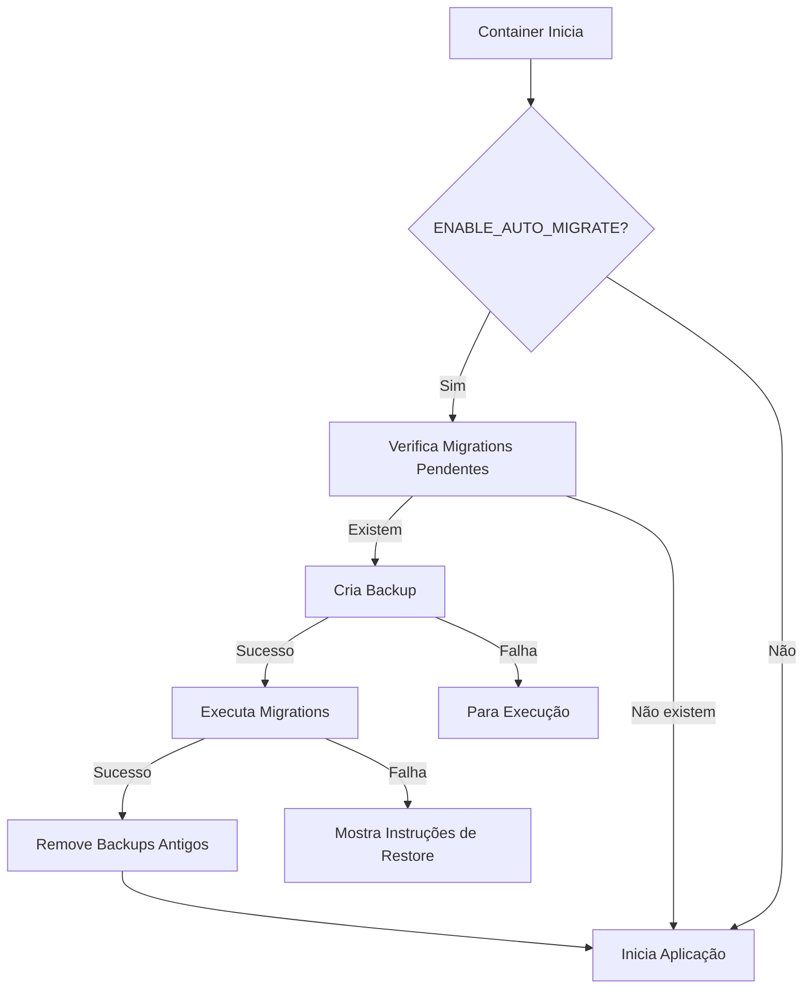

# 🔄 Backup Automático e Migrations

## ✨ O que foi configurado

### 1. **Backup Automático**
- ✅ Backup automático ANTES de cada migration
- ✅ Compressão dos backups (gzip)
- ✅ Retenção configurável (padrão: 7 backups)
- ✅ Verificação de integridade
- ✅ Listagem dos backups disponíveis

### 2. **Migrations Automáticas**
- ✅ Verificação de migrations pendentes
- ✅ Execução apenas se houver migrations novas
- ✅ Rollback em caso de erro
- ✅ Log detalhado de todas as operações

### 3. **Segurança**
- ✅ Backup obrigatório antes de migrations
- ✅ Parada em caso de falha no backup
- ✅ Instruções de restore em caso de erro
- ✅ Safety backup ao fazer restore manual

## 📦 Como Ativar

### 1. Adicione ao seu arquivo `.env`:

```bash
# Ativar migrations automáticas com backup
ENABLE_AUTO_MIGRATE=true

# Ativar apenas backup (sem migrations)
ENABLE_AUTO_BACKUP=true

# Configurar retenção de backups (dias)
BACKUP_RETENTION=7

# Diretório de backups (deve ser volume persistente)
BACKUP_DIR=/app/storage/backups
```

### 2. Atualize o docker-compose.yaml:

```yaml
services:
  rails:
    volumes:
      - storage_data:/app/storage  # Já existe
      - backup_data:/app/storage/backups  # Adicionar

volumes:
  backup_data:  # Adicionar volume para backups
```

### 3. Deploy e reinicie:

```bash
# Fazer pull das mudanças
git pull

# Reconstruir imagem (se necessário)
docker-compose build

# Reiniciar com as novas configurações
docker-compose down
docker-compose up -d
```

## 🔍 Como Funciona

### Fluxo da Migration Automática:



## 📊 Monitoramento

### Ver logs do processo:
```bash
# Ver logs de startup (incluindo migrations e backups)
docker logs chatwoot_rails_1

# Seguir logs em tempo real
docker logs -f chatwoot_rails_1
```

### Verificar backups disponíveis:
```bash
# Listar backups
docker exec chatwoot_rails_1 ls -lh /app/storage/backups/

# Contar backups
docker exec chatwoot_rails_1 ls /app/storage/backups/*.gz | wc -l
```

### Verificar migrations pendentes:
```bash
docker exec chatwoot_rails_1 bundle exec rails db:migrate:status
```

## 🔧 Operações Manuais

### Fazer backup manual:
```bash
docker exec chatwoot_rails_1 bash -c '
  TIMESTAMP=$(date +%Y%m%d_%H%M%S)
  PGPASSWORD=$POSTGRES_PASSWORD pg_dump \
    -h $POSTGRES_HOST \
    -U $POSTGRES_USERNAME \
    -d $POSTGRES_DATABASE \
    > /app/storage/backups/manual_backup_${TIMESTAMP}.sql
  gzip /app/storage/backups/manual_backup_${TIMESTAMP}.sql
'
```

### Restaurar backup:
```bash
# Listar backups disponíveis
docker exec -it chatwoot_rails_1 /app/docker/scripts/restore_backup.sh

# Restaurar backup específico
docker exec -it chatwoot_rails_1 /app/docker/scripts/restore_backup.sh \
  /app/storage/backups/chatwoot_backup_20240309_120000.sql.gz
```

## ⚠️ Importante

### Primeira Execução
Na primeira vez após ativar, todas as migrations pendentes serão executadas, incluindo:
- Migrations do Kanban (10+ tabelas)
- Outras migrations acumuladas

### Backup Storage
Os backups são salvos em `/app/storage/backups/` dentro do container.
**CERTIFIQUE-SE** de que este diretório está em um volume persistente!

### Espaço em Disco
Cada backup pode ocupar 10-100MB dependendo do tamanho do banco.
Com retenção de 7 dias, reserve pelo menos 1GB para backups.

## 🚨 Troubleshooting

### Erro: "Backup failed"
- Verifique permissões do diretório
- Verifique espaço em disco
- Verifique credenciais do PostgreSQL

### Erro: "Migration failed"
- Um backup foi criado automaticamente
- Use o script de restore para reverter
- Verifique os logs para identificar o erro

### Como desativar temporariamente:
```bash
# No arquivo .env, mude para:
ENABLE_AUTO_MIGRATE=false
```

## 📈 Benefícios

1. **Zero Downtime**: Migrations rodam antes da aplicação iniciar
2. **Segurança Total**: Sempre tem backup antes de alterações
3. **Automatização**: Não precisa lembrar de rodar migrations
4. **Rastreabilidade**: Logs completos de todas operações
5. **Recuperação Fácil**: Scripts prontos para restore

## 🎯 Próximos Passos

1. ✅ Adicionar as variáveis ao `.env`
2. ✅ Fazer commit e push das mudanças
3. ✅ Deploy no servidor
4. ✅ Reiniciar containers
5. ✅ Verificar logs para confirmar execução

As migrations do Kanban serão executadas automaticamente e o sistema de backup protegerá seus dados!